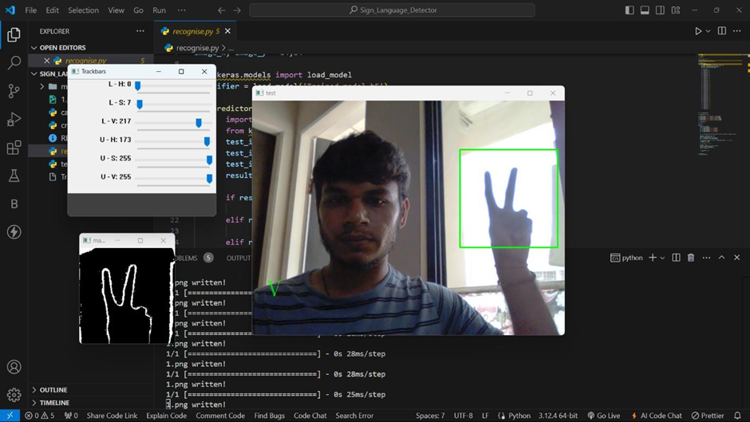
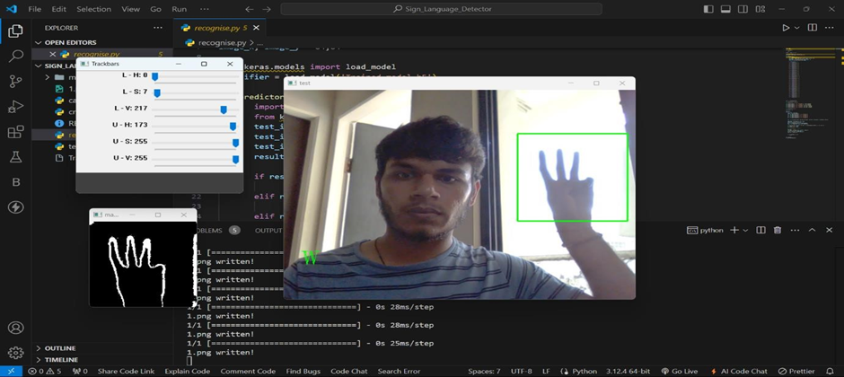
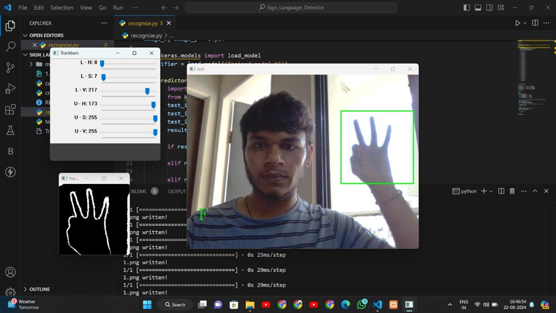
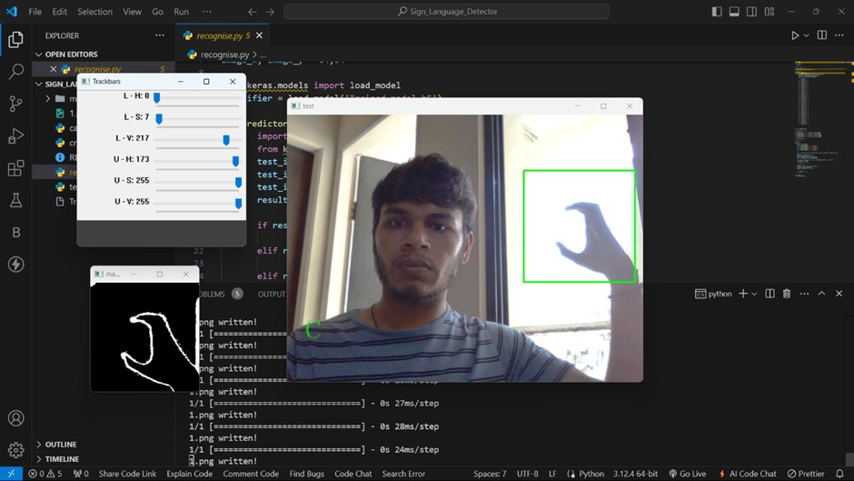

# Sign Language Detection App

This project is a Sign Language Detection application that uses machine learning to recognize sign language gestures from images or webcam input. It is designed to help users learn and communicate using sign language more effectively.

## Features

- Real-time sign language gesture detection
- Supports webcam input

## Output Examples

Below are examples of the app's output:

  
  

  
  

